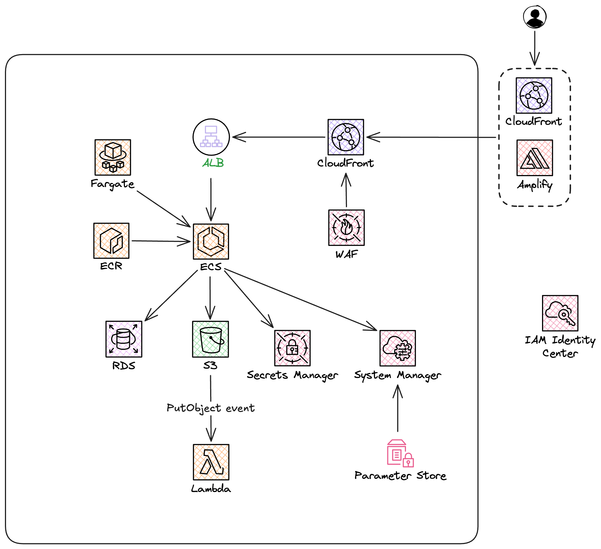
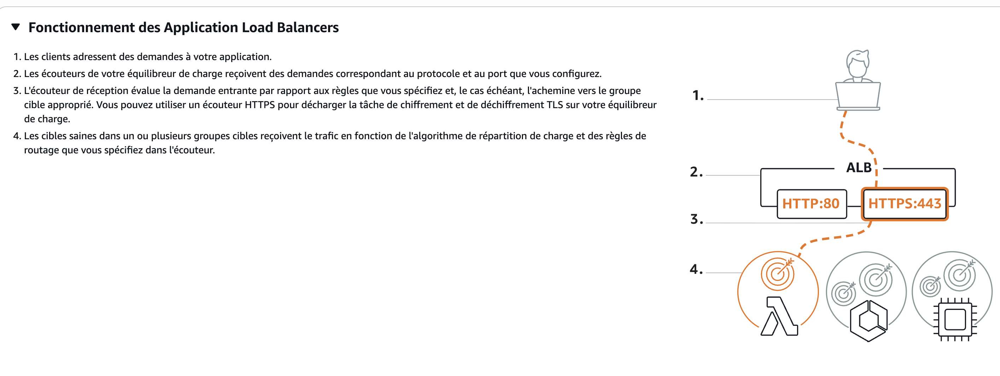

Les projets sont disponible dans ces repos ci dessous : 

- [nova-core](https://github.com/Nova-Center/nova-core) (API)
- [nova-connect](https://github.com/tavananh95/nova-connect) (Next.js frontend)

URL de l'application déployée : 

https://main.dk9lkc5yg76k.amplifyapp.com/

---

# Partie 1 - Projet (architecture AWS)

### ECR

Nous avons créé le référentiel `nova/core` sur **ECR** en région *eu-west-1*. Il nous sert de registre privé centralisé pour stocker et versionner les images Docker de notre API.

Nous avons choisi le chiffrement AES-256 géré nativement par AWS. Il est activé par défaut sur toutes les images stockées sans configuration supplémentaire, ce qui correspond parfaitement à notre cas simple à mettre en place, transparent à l'usage, et complètement suffisant. 

L'alternative (CMK via AWS KMS) aurait ajouté une complexité de gestion de clés sans bénéfice justifié pour nous.

Nous avons configuré les tags en mode immuable, à l'exception du tag latest qui reste réécrivable. Cela garantit que chaque tag de version (private-s3-v1, v2…) pointe définitivement vers la même image, évitant les
régressions silencieuses en production, tout en conservant la commodité de latest pour nos déploiements rapides.



### ECS & Fargate

Une fois notre référentiel ECR en place et nos images disponibles, nous avons créé un cluster ECS pour orchestrer et exécuter notre conteneur d'API en production. Nous avons choisi le **mode Express** qui utilise **AWS Fargate** par défaut, ce qui nous évite d'avoir à provisionner, configurer et maintenir des instances EC2. Fargate adopte une approche serverless du conteneur, nous déclarons simplement les ressources dont notre application a besoin, et AWS gère entièrement l'infrastructure sous-jacente.

Le service créé se nomme **`core-f746`** et tourne dans le cluster `default` en région `eu-west-1`.


#### Rôles IAM

Deux rôles ont été créés pour que notre service fonctionne correctement :

- **`ecsTaskExecutionCustomRole`** (rôle d'exécution) : c'est le rôle utilisé par Fargate lui-même pour bootstrapper le conteneur. Il lui permet de puller notre image depuis ECR, de récupérer les variables d'environnement depuis le Parameter Store et Secrets Manager au démarrage, et d'écrire les logs dans CloudWatch. 

Sans ce rôle, le conteneur ne pourrait tout simplement pas démarrer. Nous l'avons d'ailleurs expérimenté lors de nos premiers déploiements, Fargate échouait avec une `AccessDeniedException` car les permissions SSM n'étaient pas encore correctement définies.
- **`ecsTaskRole`** (rôle applicatif) : c'est le rôle endossé par notre application à l'intérieur du conteneur une fois qu'il est en cours d'exécution. Il lui permettra de communiquer avec d'autres services AWS de notre infrastructure (S3, etc.).
    
    ```json
    {
        "Version": "2012-10-17",
        "Statement": [
            {
                "Sid": "ListBucket",
                "Effect": "Allow",
                "Action": [
                    "s3:ListBucket"
                ],
                "Resource": "arn:aws:s3:::cloud-nova-images"
            },
            {
                "Sid": "UploadsWrite",
                "Effect": "Allow",
                "Action": [
                    "s3:GetObject",
                    "s3:PutObject",
                    "s3:DeleteObject"
                ],
                "Resource": "arn:aws:s3:::cloud-nova-images/uploads/*"
            },
            {
                "Sid": "ResizedReadOnly",
                "Effect": "Allow",
                "Action": [
                    "s3:GetObject"
                ],
                "Resource": "arn:aws:s3:::cloud-nova-images/resized/*"
            }
        ]
    }
    ```
    
- **`ecsInfrastructureRoleForExpressServices`** : ce rôle est utilisé par ECS pour gérer l'infrastructure réseau associée au service load balancer, security groups, certificats SSL/TLS et configuration de l'auto scaling.

#### Task Definition

La task definition `default-core-f746` décrit précisément comment notre conteneur doit être lancé :

| Paramètre | Valeur |
| --- | --- |
| Image | `nova/core:private-s3-v6` |
| CPU | 1 vCPU |
| Mémoire | 2048 Mo |
| Port exposé | `8080` (TCP) |
| Health check | `/` |
| Mode réseau | `awsvpc` (IP dédiée par tâche) |

**Injection des variables d'environnement depuis les secrets** : aucune valeur sensible n'est codée en dur dans la task definition. Toutes les variables sont injectées dynamiquement au démarrage depuis le **Parameter Store** et **Secrets Manager** :

- `DB_PASSWORD` et `DB_USER` sont lus directement depuis **Secrets Manager** (secret RDS rotatif)
- Les 13 autres variables (`APP_KEY`, `DB_HOST`, `DB_PORT`, `S3_BUCKET`, `NODE_ENV`, etc.) sont lues depuis le **Parameter Store**

Cette approche garantit que l'image Docker reste totalement agnostique de l'environnement, la même image peut être déployée dans n'importe quel environnement en changeant uniquement les paramètres pointés.


**Logs** : les sorties du conteneur sont envoyées automatiquement vers CloudWatch Logs dans le groupe `/aws/ecs/default/core-f746-c44f` avec le préfixe `ecs`.

#### Stratégie de déploiement

Un point notable : nous avons activé la stratégie de déploiement **Canary** avec la configuration suivante :

- **5% du trafic** est d'abord redirigé vers la nouvelle version pendant **3 minutes** de bake time
- Si aucune alarme ne se déclenche, le déploiement bascule à 100%
- En cas d'échec, un **rollback automatique** est déclenché

Cette stratégie nous protège des régressions en production, si la nouvelle version est défectueuse, seule une infime fraction du trafic est impactée avant que le rollback ne soit automatiquement opéré. Nous l'avons d'ailleurs observé en pratique un déploiement a été automatiquement rollbacké suite au déclenchement de l'alarme `default/core-f746/RollbackAlarm`.


### RDS

- Secret stocke dans AWS Secrets Manager
- Les taches ECS sur Fargate utilisent les parametres RDS (`DB_HOST`, `DB_PORT`, `DB_DATABASE`, `DB_USER`, `DB_PASSWORD`) pour etablir la connexion PostgreSQL entre l'API et l'instance `nova-db`.
- Exemple de connexion PostgreSQL avec recuperation du mot de passe via secret:

```bash
psql "host=$RDSHOST port=5432 dbname=postgres user=postgres sslmode=verify-full sslrootcert=./global-bundle.pem password=$(aws secretsmanager get-secret-value --secret-id 'arn:aws:secretsmanager:eu-west-1:682405976856:secret:rds!db-f5009b56-3220-4afa-a5f8-62146034ed37-dQqhJn' --query SecretString --output text | jq -r '.password')"
```

### Sauvegardes automatiques RDS

- Sauvegarde automatique quotidienne
- Retention des sauvegardes: 1 semaine
- Possibilite de restauration a un instant precis (point-in-time recovery) sur la periode de retention

### Chiffrement RDS

- Chiffrement active
- Cle KMS: `aws/rds`
  
#### Réseau

Le service est déployé en mode **`awsvpc`**, ce qui attribue une interface réseau dédiée à chaque tâche Fargate. Il est réparti sur **3 sous-réseaux** de la VPC en `eu-west-1` pour garantir la disponibilité multi-AZ, et exposé via un **Application Load Balancer** avec deux target groups actifs qui permettent les déploiements Canary sans interruption de service.


> **Problème rencontré - architecture ARM64 vs AMD64** : nos images étaient initialement buildées sur un Mac Apple Silicon (ARM64). Fargate s'exécutant sur une infrastructure `linux/amd64`, le conteneur était incapable de
démarrer car l'architecture de l'image était incompatible. Nous avons résolu le problème en forçant le build en `amd64` :
> 
> 
> ```bash
> docker build --platform linux/amd64 -t nova/core .
> ```
> 

### Secrets Manager

Le secrets manager va lui nous permettre de pouvoir stocker des données sensible. Nous avons un seul secret est présent : les credentials de connexion à la base de données RDS PostgreSQL (nova-db).


Ce secret a été créé automatiquement par RDS lors de la création de l'instance nova-db. C'est le mécanisme natif d'AWS appelé "RDS managed secret" : au lieu de définir un mot de passe manuellement, on a laissé RDS générer et stocker les credentials dans Secrets Manager.

Nous avons fait ce choix car : 

1. **Rotation automatique tous les 7 jours :** le mot de passe tourne automatiquement, sans intervention manuelle. RDS met à jour le secret et la base de façon synchronisée.
2. **Pas de credentials en clair :** le mot de passe n'apparaît jamais dans le code, les variables d'environnement ou les fichiers de config. L'application (ou un Lambda) récupère le secret à runtime via l'API Secrets
Manager.
3. **Sécurité IAM** : l'accès au secret est contrôlé par des policies IAM, pas par un mot de passe partagé.

Le secret sera utilisé dans le service ECS qui va permettre à l’API qui tourne de pouvoir intéragir avec la base de données.

### **Systems Manager - Parameter Store**

Nous avons utilisé **AWS Systems Manager Parameter Store** pour centraliser et sécuriser l'ensemble des variables de configuration de notre API en environnement de production. Plutôt que d'embarquer ces valeurs dans notre image Docker ou de les gérer via des fichiers `.env` éparpillés, nous les stockons dans un emplacement unique, versionné et contrôlé par IAM. 

Cela nous permet de modifier une configuration sans avoir à rebuilder ou
redéployer une nouvelle image, ce qui simplifie considérablement la gestion opérationnelle.

Tous nos paramètres suivent une convention de nommage hiérarchique claire : `/nova/prod/core/<paramètre>`, ce qui nous permet de les organiser par projet, environnement et service, et de les retrouver facilement.


Nous avons structuré nos paramètres en deux catégories selon leur sensibilité :

#### Paramètres sensibles — `SecureString` (chiffrés via KMS)

Ces valeurs sont chiffrées au repos avec la clé AWS gérée `alias/aws/ssm` et ne sont jamais visibles en clair dans la console ou les logs :

| Paramètre | Rôle |
| --- | --- |
| `/nova/prod/core/appKey` | Clé applicative de l'API (signature, chiffrement interne) |
| `/nova/prod/core/awsSecretAccessKey` | Clé secrète AWS pour l'accès programmatique à S3 |

#### Paramètres non sensibles — `String`

Ces valeurs sont des informations de configuration sans risque d'exposition critique :

| Paramètre | Rôle |
| --- | --- |
| `dbHost` / `dbPort` / `dbDatabase` | Connexion à l'instance RDS PostgreSQL |
| `pgSslMode` | Mode SSL pour la connexion à la base de données |
| `awsAccessKeyId` / `awsRegion` | Identité AWS pour l'accès à S3 |
| `s3Bucket` | Nom du bucket S3 utilisé par l'API |
| `driveDisk` | Driver de stockage de fichiers (S3) |
| `host` / `port` | Adresse et port d'écoute de l'API |
| `nodeEnv` | Environnement d'exécution Node.js (`production`) |
| `logLevel` | Niveau de verbosité des logs |
| `tz` | Fuseau horaire de l'application |

#### Pourquoi Parameter Store plutôt que des variables d'environnement classiques

Stocker nos configurations dans Parameter Store nous apporte plusieurs avantages concrets par rapport à des variables d'environnement injectées manuellement :

- **Versionnage** : chaque modification d'un paramètre crée une nouvelle version. Nous pouvons consulter l'historique et revenir en arrière si nécessaire par exemple, `dbHost` et `dbDatabase` sont déjà à leur version 2 et 3, ce qui reflète des ajustements réalisés après le premier déploiement.
- **Contrôle d'accès fin** : l'accès aux paramètres est géré par des policies IAM. Seuls les services et utilisateurs autorisés peuvent lire ou modifier une valeur, ce qui réduit la surface d'attaque.
- **Séparation des responsabilités** : notre image Docker ne contient aucune configuration spécifique à l'environnement. La même image peut être déployée en staging ou en production simplement en changeant les paramètres lus au démarrage.
- **Traçabilité** : chaque modification est associée à un utilisateur IAM (`salah-serverless`, `anh-serverless`), ce qui nous permet de savoir qui a changé quoi et quand.

#### Tier utilisé

Nous avons opté pour le **tier Standard** sur l'ensemble des paramètres. Il est gratuit pour les premiers 10 000 paramètres et couvre largement nos besoins actuels. Le tier Advanced (payant) n'aurait apporté aucun bénéfice justifié pour notre volume et nos cas d'usage.

### ALB

L'**Application Load Balancer** (ALB) constitue le point d'entrée unique de notre API. Il est créé automatiquement par ECS en mode Express via le rôle `ecsInfrastructureRoleForExpressServices`, et se charge de recevoir le trafic externe, de terminer le SSL/TLS, puis de le redistribuer vers notre conteneur Fargate.


#### Disponibilité multi-AZ

L'ALB est déployé sur les **3 zones de disponibilité** de la région `eu-west-1` (`eu-west-1a`, `eu-west-1b`, `eu-west-1c`), chacune dans son propre sous-réseau. Cela garantit qu'une défaillance d'une zone n'interrompt pas le service.

#### Listeners & SSL/TLS

Deux listeners sont configurés :

| Port | Protocole | Action |
| --- | --- | --- |
| `443` | HTTPS | Forward vers le target group actif |
| `80` | HTTP | Forward vers le target group actif |

Le listener HTTPS utilise un **certificat SSL émis par AWS Certificate Manager (ACM)**, généré automatiquement pour le domaine ECS fourni par AWS :
`co-64d04bd0e3a543c9a00182d31e71a818.ecs.eu-west-1.on.aws`

Le certificat est de type **RSA-2048 / SHA-256**, validé par DNS, valide jusqu'au **2 novembre 2026** et éligible au renouvellement automatique. La politique TLS appliquée est `ELBSecurityPolicy-TLS13-1-2-Ext1-PQ-2025-09`, qui impose **TLS 1.2 minimum** et supporte **TLS 1.3** ainsi que les algorithmes post-quantiques la politique la plus récente et la plus sécurisée proposée par AWS.

#### Target Groups & déploiement Canary

Deux target groups identiques sont présents :

| Target Group | Rôle |
| --- | --- |
| `ecs-gateway-tg-7e3d31269bf24686b` | Version A (Blue) |
| `ecs-gateway-tg-b288898a37be3d0be` | Version B (Green) |

Ces deux target groups permettent à ECS de basculer progressivement le trafic lors d'un déploiement Canar, 5% est d'abord dirigé vers le nouveau target group, puis 100% une fois le bake time écoulé sans alarme. Entre
les deux déploiements, l'ALB désenregistre les anciennes tâches et enregistre les nouvelles sans interruption de service.

Chaque target group est configuré de la même façon :

| Paramètre | Valeur |
| --- | --- |
| Type de cible | `ip` (mode `awsvpc` Fargate) |
| Port de health check | `8080` |
| Chemin de health check | `/` |
| Code HTTP attendu | `200` |
| Intervalle | 30 secondes |
| Timeout | 5 secondes |
| Seuil healthy | 5 checks consécutifs |
| Seuil unhealthy | 2 checks consécutifs |

Le health check frappe directement le port `8080` du conteneur sur la route `/`, ce qui est cohérent avec notre configuration ECS.

L'ALB n'est pas exposé directement sur internet. Nous avons placé **AWS CloudFront** devant lui, ce qui constitue le véritable point d'entrée de notre API. CloudFront est un CDN mondial qui absorbe le trafic au plus proche des utilisateurs avant de le relayer vers notre ALB en `eu-west-1`. Un **Web ACL WAF** est attaché à cette distribution pour filtrer les requêtes
malveillantes en amont.

#### CloudFront

La distribution active (`E2AVEQVGLNLRRW`, domaine `d394fr64104nt8.cloudfront.net`) est configurée avec l'ALB comme origine :

| Paramètre | Valeur |
| --- | --- |
| Origine | `ecs-express-gateway-alb-77639626` (notre ALB) |
| Protocole vers l'origine | HTTP (port 80) |
| Protocole vers les clients | HTTPS uniquement (`redirect-to-https`) |
| Méthodes autorisées | `GET`, `HEAD`, `POST`, `PUT`, `PATCH`, `DELETE`, `OPTIONS` |
| Cache | Désactivé (`CachingDisabled`) — tout le trafic est transmis en direct à l'API |
| Compression | Désactivée |
| IPv6 | Activé |
| Price Class | `PriceClass_All` — tous les points de présence CloudFront dans le monde |


Le cache est volontairement désactivé car notre API est dynamique, chaque requête doit atteindre le conteneur. CloudFront est utilisé ici non pas pour mettre en cache des réponses, mais pour bénéficier de la protection WAF, du réseau global AWS et du SSL géré.

> **Note** : une seconde distribution (`E355BGPEXX2AOT`) est marquée `Staging: true`  il s'agit de la distribution de staging utilisée lors des tests, également pointée sur le même ALB mais avec un protocole vers l'origine en HTTPS uniquement (TLS 1.2).
> 

---

#### WAF

Un **Web ACL WAF v2** (`CreatedByALB-f608951e-302c-4397-951e-899ba0961d93`) est attaché à notre distribution CloudFront. Il est déployé en scope `GLOBAL` (hébergé en `us-east-1`, obligatoire pour CloudFront) et applique 6 règles managées par AWS :

| Priorité | Règle | Rôle |
| --- | --- | --- |
| 0 | `AWSManagedRulesAntiDDoSRuleSet` | Protection anti-DDoS avec challenge HTTPS sur les IPs suspectes. Les routes `/api/` et les assets statiques (images, JS, CSS…) sont exemptés pour ne pas bloquer les appels légitimes |
| 1 | `RateBasedRule-IP-300` | Limite à **300 requêtes par IP** sur une fenêtre de 5 minutes |
| 2 | `AWSManagedRulesAmazonIpReputationList` | Bloque les IPs connues comme malveillantes (botnets, scrapers, acteurs malveillants répertoriés par AWS) |
| 3 | `AWSManagedRulesCommonRuleSet` | Règles générales contre les attaques web courantes (XSS, path traversal, etc.) |
| 4 | `AWSManagedRulesKnownBadInputsRuleSet` | Bloque les patterns d'entrée connus comme dangereux (Log4j, SSRF, etc.) |
| 5 | `AWSManagedRulesSQLiRuleSet` | Protection contre les injections SQL |


Toutes les règles sont actuellement en mode **`Count`** (observation) plutôt qu'en mode `Block`. Cela signifie que les requêtes correspondantes sont comptabilisées et loggées dans CloudWatch, mais non bloquées. Ce mode permet de valider que les règles ne génèrent pas de faux positifs sur notre trafic légitime avant de basculer en mode bloquant.

L'action par défaut du WAF est **`Allow`** tout ce qui ne correspond à aucune règle passe librement.

---
### S3 Storage
Stockage objet privé des médias applicatifs.

- Rôle : réception des images uploadées (uploads/...) et lecture des images optimisées (resized/...) via URL présignées.


- Justification : service managé, durable, scalable, coût maîtrisé, adapté au flux upload + traitement asynchrone Lambda.


- Intégration backend (ECS Node.js)

Variables utilisées :
DRIVE_DISK=s3
AWS_REGION=eu-west-1
S3_BUCKET=cloud-nova-images
PORT=8080, HOST=0.0.0.0


En production AWS: pas de AWS_ACCESS_KEY_ID, AWS_SECRET_ACCESS_KEY, S3_ENDPOINT (auth via Task Role IAM).


Librairies utilisées :
@adonisjs/drive (abstraction stockage)
flydrive (driver S3 sous-jacent)
@aws-sdk/client-s3 / presign via Flydrive 
---
### Lambda
Traitement automatique des images à l’upload.

- Rôle : déclenchée par événement S3 ObjectCreated sur préfixe uploads/, lit l’original, redimensionne/comprime, écrit en resized/.


- Justification : traitement asynchrone serverless, simple à opérer, coût à l’usage, découplé du backend API.


- Intégration : S3 déclenche Lambda; Lambda utilise son rôle IAM pour GetObject sur uploads/* et PutObject sur resized/*; le backend consomme ensuite les fichiers resized/.
---
### Amplify
Hébergement et déploiement continu du frontend (Next.js), avec build automatique depuis le dépôt Git.

- Rôle : publier l’interface web, gérer les environnements (preview/prod) et exposer le domaine frontend.


- Justification : mise en production simple, CI/CD intégré, gestion native du hosting frontend AWS.


- Intégration : le frontend déployé sur Amplify appelle l’API backend via CloudFront/ALB et affiche les URLs présignées retournées par l’API pour les images.

#### Pourquoi Amplify et pas S3 statique ?

Amplify est le bon choix ici car ce frontend n'est pas un simple site statique:

- Projet Next.js App Router avec logique serveur (ex: route NextAuth `/api/auth/[...nextauth]`).
- Authentification NextAuth nécessite un runtime serveur pour gérer sessions/cookies/callbacks.
- CI/CD Git intégré (build à chaque push), previews de branches, domaine/SSL simplifiés.
- Support natif du déploiement Next.js moderne sans refactor majeur.

S3 statique conviendrait seulement pour un site 100% exportable (`next export`) sans runtime serveur.
Dans l'état actuel du code, passer en S3 statique demanderait une refonte de l'auth et des routes serveur.
